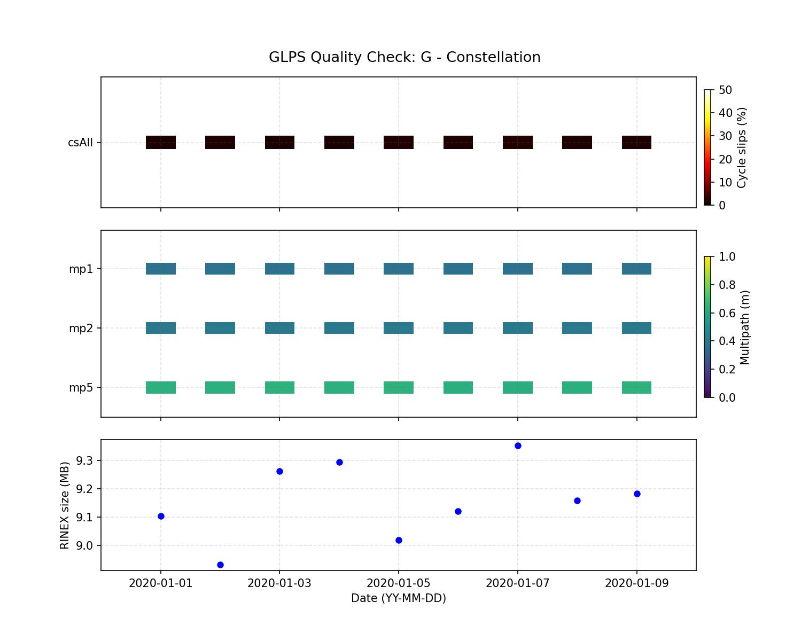

# GRINQ - GNSS RINEX Ingestion and Quality Control

[](https://www.python.org/)
[](LICENSE)

---

**GRINQ** is an open-source python toolbox for retrieving, mirroring GNSS rinex data from numerous data holdings. It also generates a subset of metrics for quality control (QC). 


## Main features

- GNSS RINEX data retrieval
- RINEX data mirroring and synchronization
- GNSS station data management
- RINEX quality control and statistics
- Integration with GNSS data repositories
- Command-line tools for automated GNSS data processing
- Python-based scientific computing workflows


## Package Installation:

**GRINQ** works under Anaconda/minicoda and has been tested with Python 3.10, 3.11 and 3.12. 

It is recommended to install GRINQ in a dedicated virtual environment to avoid dependency conflicts 
with other Python packages.

```
conda create -n grinq python=3.11
conda activate grinq
python -m pip install --upgrade pip
pip install git+https://github.com/PJarrin/grinq.git

```

If you have downloaded a GRINQ source distribution (.tar.gz / .zip), it can be installed with:
```
pip install grinq-XXX.tar.gz
```

### Additional dependencies

Additional packages are required to retrieve RINEX files from other data holdings such as [Unavco][web_unavco]
for instance.  Therefore, the earthscope application manages key authentication and must be installed with:

```
pip install earthscope-sdk==0.2.1  
```

### <u> 1. FTP data mirroring </u>

Grinq provides a file-mirroring utility for cloning data from remote FTP servers. This feature requires
the lftp program, which can be installed either on your operating system or within a Conda environment.
If lftp is already installed on the operating system, the Python package is optional. Otherwise, the Python 
version is strongly recommended. If both versions are installed, grinq uses the python lftp package by default.

To install lftp in a Conda environment:

```
conda install conda-forge::lftp
```

### <u> 2. QC statistics </u>
Grinq wraps the Anubis' software and automates the computation of quality statistics
of RINEX metadata. [Anubis][web_anubis] must be installed in your OS
by making a registration to retrieve the open access release

```
chmod +x anubis-3.11-lin-static-64b
ln -s anubis-3.11-lin-static-64b /geodesy/bin/anubis

Then, set in your .bashrc or .zshrc:
export PATH=/geodesy/bin:$PATH
```

## Usage

GRINQ provides several command-line utilities for retrieving, processing and
quality-controlling GNSS RINEX data.


### 1. Retrieve RINEX data

To retrieve RINEX data for a specific station and day(s):
```
grinq_get_rinex.py -c sopac  -syr 2018 -eyr 2018 -sd 1 -ed 2 -dir Rinex -site glps

 -- Looking for rinex in sopac data center
     glps0010.18d.Z: █████████████████████████████████ 100% | 795kiB/s
     glps0020.18d.Z: █████████████████████████████████ 100% | 774kiB/s

Output: Rinex
        └── 2018
            ├── 001
            │   └── glps0010.18d.Z
            └── 002
                └── glps0020.18d.Z       


grinq_get_rinex.py -c cddis  -syr 2025 -eyr 2025 -sd 10 -ed 10 -dir Rinex -site ABMF00GLP 

  -- Looking for rinex in cddis data center
    - Downloading: ABMF00GLP_R_20250100000_01D_30S_MO.crx.gz
     ABMF00GLP_R_20250100000_01D_30S_MO.crx.gz: █████████████████████████ 100% | 2.51MiB/s

Remind: Progress information depends on the number of files and download speed.


For a complete list of options: grinq_get_rinex.py --help
```
To retrieve RINEX data for a list of stations and day(s):
```
Define a list of stations using a single column:
list_rinex.dat: 
 riop
 areq

grinq_get_rinex.py -c cddis  -syr 2018 -eyr 2018 -sd 10 -ed 12 -dir Rinex -ilist list_rinex.dat

```
To retrieve RINEX data using mirroring implementation:

```
- Clone a specific directory within ftp server
  
  grinq_ftp_mirror_sync.py -user 'anonymous' -passw 'anonymous' -url 'ftp://rgpdata.ign.fr' -ldir /data/../Rinex -rdir '/pub/data/2026/001' -custom 'data_30'
  
  -- Using lftp at: /usr/bin/lftp
  [2024-08-13 10:22:09] |Info| Making directory `data_30'
  [2024-08-13 10:22:09] |Info| Transferring file `data_30/aaer0010.26d.Z'
  [2024-08-13 10:22:11] |Info| Transferring file `data_30/aaer0010.26g.Z'
  [2024-08-13 10:22:11] |Info| Transferring file `data_30/aaer0010.26n.Z'
  ...
  [2024-08-13 10:28:20] |Info| Total: 1 directory, 1524 files, 0 symlinks
  [2024-08-13 10:28:20] |Info| New: 1524 files, 0 symlinks
  [2024-08-13 10:28:20] |Info| 542599918 bytes transferred in 370 seconds (1.40 MiB/s)
  -- Cloned 6.2 minutes
  -- Processing details in clone_20240813.log
 
 
- Clone all directory structure from ftp server (full synchronization):
  
  grinq_ftp_mirror_sync.py -user 'anonymous' -passw 'anonymous' -url 'ftp://rgpdata.ign.fr' -ldir /data/../Rinex -rdir '/pub/data/2026'
  
  
For a complete list of options: grinq_ftp_mirror_sync.py --help
  
```
### 2. Quality statistics
Create two directories containing the navigation (broadcast) and RINEX files for the desired dates.
All of them can be compressed or uncompressed files. If the RINEX files contain observations from multiple 
GNSS constellations, the corresponding navigation files must also include all those constellations. 
Otherwise, statistics are computed from the navigation data available in the input files and therefore 
depend on the provided GNSS constellations and navigation messages.

```
Rinex                       brdc 
└── glps0010.20d.Z          └── BRDC00IGS_R_20200010000_01D_MN.rnx.gz
└── glps0020.20d.Z          └── BRDC00IGS_R_20200020000_01D_MN.rnx.gz
└── glps0030.20d.Z          └── BRDC00IGS_R_20200030000_01D_MN.rnx.gz
...                         ...

grinq_make_qc.py -nav brdc -rnx rinex -plots

-- Preparing rinex
    - glps0010.20o quality check: ok
    - glps0020.20o quality check: ok
    - glps0030.20o quality check: ok
    ...
 -- Quality check metrics done
 -- Making QC summary
 -- Written: QC_sum/glps_2020_total_sum.dat
 -- Written: QC_sum/glps_2020_G_sum.dat
 -- Written: QC_sum/glps_2020_E_sum.dat
 -- Written: QC_sum/glps_2020_R_sum.dat


 Output:
 
    QC                       QC_sum 
    └── 2020                    ├── glps_2020_G_sum.dat
        ├── glps0010.xtr        ├── glps_2020_R_sum.dat
        ├── glps0020.xtr        ├── glps_2020_E_sum.dat
        ...                     ├── glps_2020_G_sum.jpg
                                ...

For a complete list of options: grinq_make_qc.py --help
 
```

**Example of QC — `sum/glps_2020_G_sum.dat`:**




## Reporting issues

Bug reports and enhancement requests are welcome. Please use the GitHub Issues page.


## Version History

See the [Change Log](CHANGELOG.md) for detailed updates.


## Citation

If you use GRINQ in your research, please cite the software:

Jarrin, P. (2026). GRINQ v0.0.1: GNSS RINEX Ingestion and Quality Control. Computer 
software. Zenodo. [doi: "10.5281/zenodo.22228489"](https://doi.org/10.5281/zenodo.22228489)


## Scientific applications

The following publications are related to the development and/or
application of GRINQ:


**Jarrin P.**, Nocquet J.-M., Rolandone F., Audin L., Mora-Páez H., 
et al. (2023). Continental block motion in the Northern Andes from GPS
measurements. Geophysical Journal International, 235(2), 1434–1464. 
[doi:10.1093/gji/ggad294](https://doi.org/10.1093/gji/ggad294)

Vidal, M., **Jarrin, P.**, Rolland, L., Nocquet, J.-M., Vergnolle, M., Sakic, P. (2024). Cost-
Efficient Multi-GNSS Station with Real-Time Transmission for Geodynamics
Applications. Remote Sensing 16(6). [doi:10.3390](https://doi.org/10.3390/rs16060991)

## Acknowledgement

GRINQ uses G-Nut/Anubis to perform RINEX quality-control analysis and
automates its execution as part of the GRINQ workflow. Anubis was
originally developed by other authors, whose work we gratefully
acknowledge.

Users who make use of the RINEX quality-control functionality are
encouraged to cite the original Anubis publication


Václavovic P. and Douša J. (2016)
G-Nut/Anubis - open-source tool for multi-GNSS data monitoring
IAG Symposia Series, Springer, Vol. 143, pp. 775-782, doi:10.1007/1345_2015_157 


## Authors
GRINQ has been implemented by **[Paul Jarrin][orcid_pj]** and uses time
libraries from **[PYACS](https://github.com/JMNocquet/pyacs36)**.  

[orcid_pj]:https://orcid.org/0000-0001-9874-1330
[web_nocquet]:https://jmnocquet.github.io/software/
[web_unavco]:https://www.unavco.org/data/data-help/submission/submission.html
[web_ringo]:https://terras.gsi.go.jp/software/ringo/en/
[web_gfzrnx]:https://gnss.gfz.de/services/gfzrnx
[web_anubis]:https://gnutsoftware.com/software/anubis/download
[pyacs065]:https://zenodo.org/records/14959022
